# internshala-notes-app

# Light-Mode-Screenshots

<table>
  <tr>
    <td width="200px"> Splash Screen</td>
    <td width="200px"> Google Sign In</td>
    <td width="200px">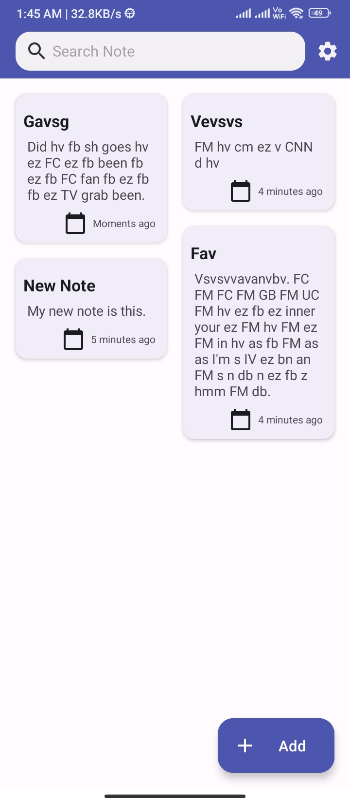 Notes List</td>
    <td width="200px">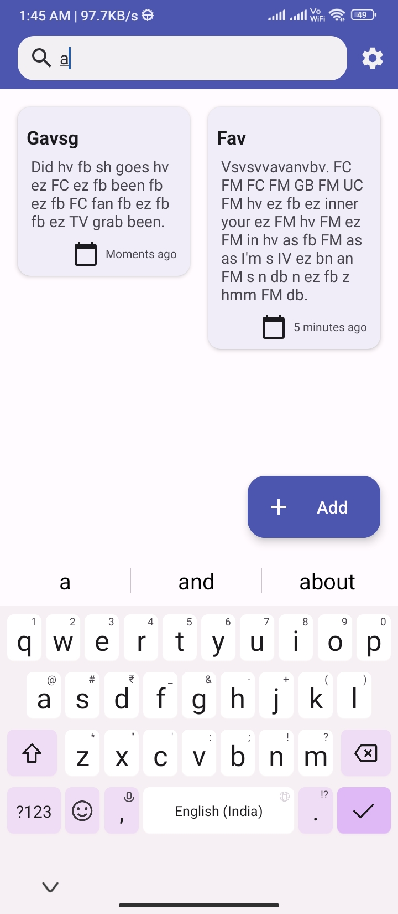 Searching Notes</td>
  </tr>
  <tr>
    <td width="200px"> Settings</td>
    <td width="200px">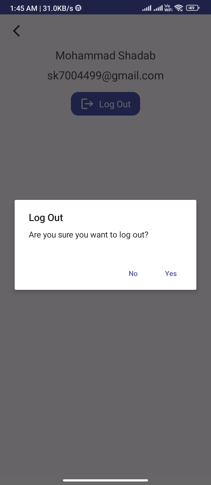 Log out</td>
    <td width="200px"> Update Note</td>
    <td width="200px">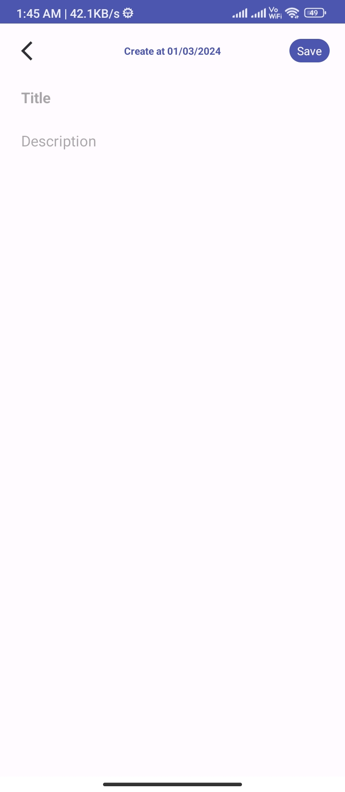 Create Note</td>
  </tr>
  <tr>
    <td width="200px">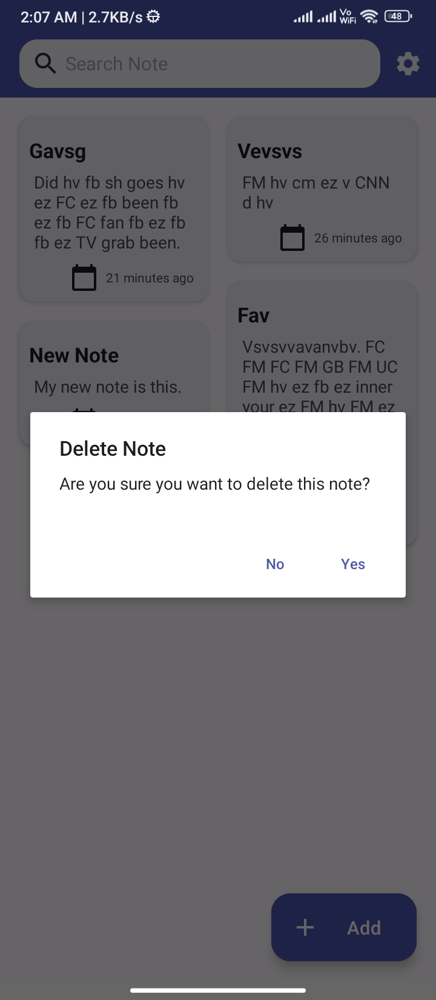 Delete Note</td>
  </tr>
</table>

  

# Dark-Mode-Screenshots

<table>
  <tr>
    <td width="200px"> Splash Screen</td>
    <td width="200px">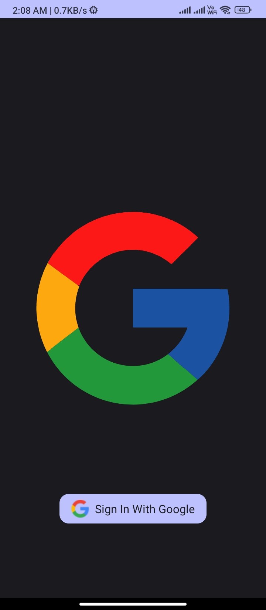 Google Sign In</td>
    <td width="200px">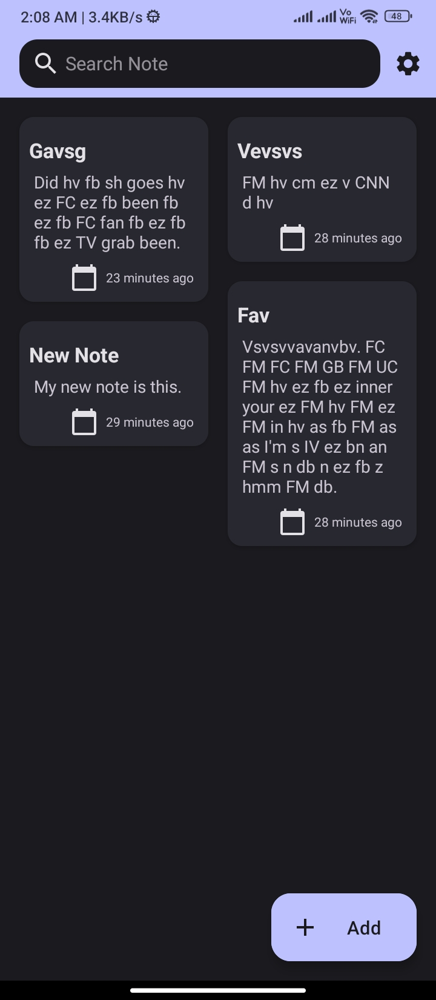 Notes List</td>
    <td width="200px">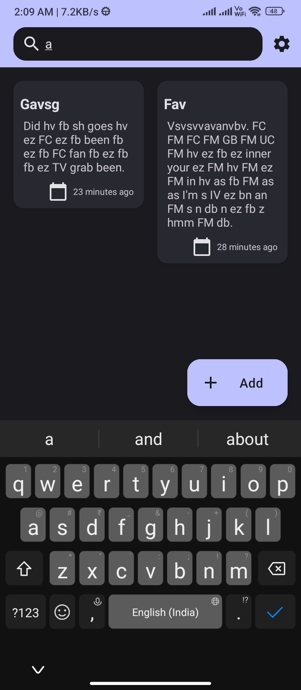 Searching Notes</td>
  </tr>
  <tr>
    <td width="200px"> Settings</td>
    <td width="200px">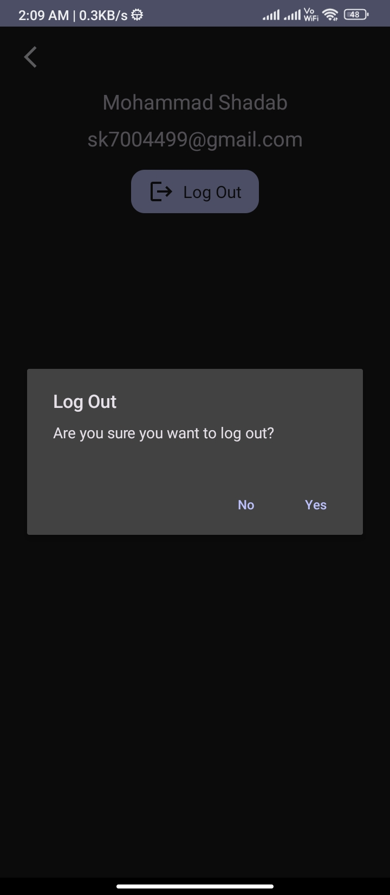 Log out</td>
    <td width="200px">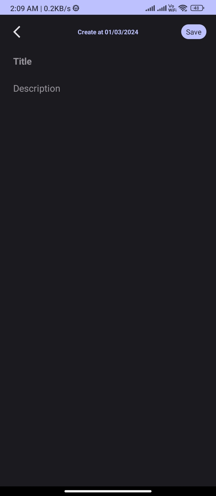 Update Note</td>
    <td width="200px">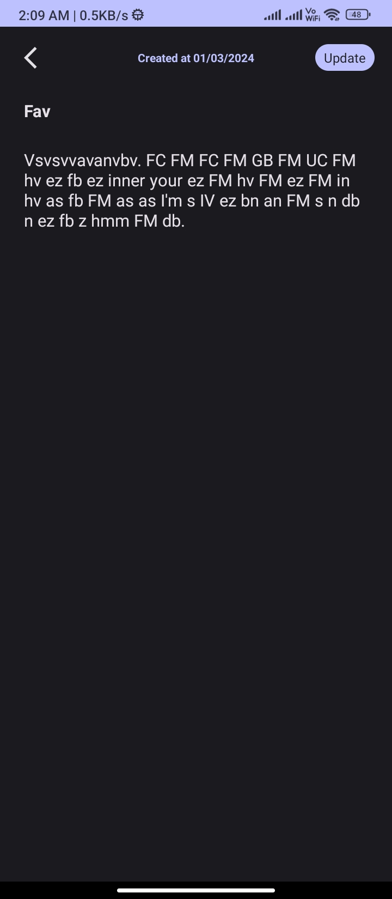 Create Note</td>
  </tr>
  <tr>
    <td width="200px">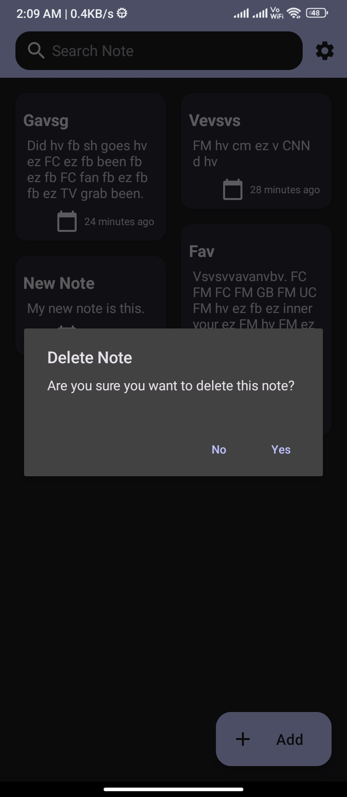 Delete Note</td>
  </tr>
</table>